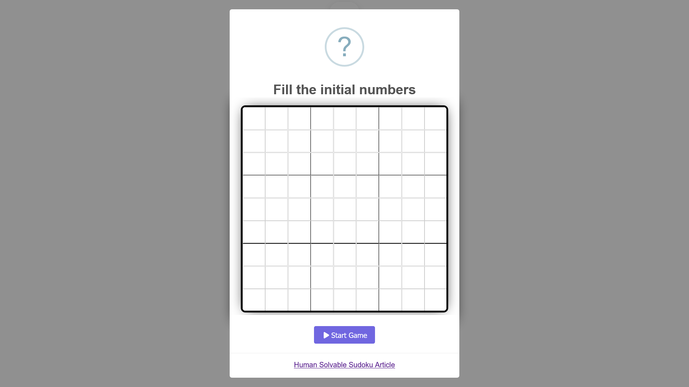

# 🔢 Simple Sudoku Game On/Offline

This is a pretty simple sudoku game that offers two fill game modes: 
- **Auto Fill**: A sudoku generator with different
levels of difficulty
- **Manual Fill**: Offers the possibility to insert sudokus. 

It's available via **Web**, **instalable platform-independent PWA**
and on **Google Play Store**.

It's made with vanilla **HTML**/**CSS**/**JS**!!!

It's intended to be playable both **online** and **offline**  in must devices/OS.

## 📇 Table of Content

* [📖 Main Functionalities](#-main-functionalities-)
* [🛠️ How it works?](#-how-it-works)
  + [🤖 Auto Fill](#-auto-fill)
    - [📜 Explanation](#-explanation)
      * [🔮 Transformations](#-transformations)
      * [🌱 Seeds by level of difficulty](#-seeds-by-level-of-difficulty)
  + [👾 Manual Fill](#-manual-fill)
    - [📜 Explanation](#-explanation-1)
      * [⚖️ Validation of the Entered Sudoku](#-validation-of-the-entered-sudoku)
      * [🦾 Solving the Entered Sudoku](#-solving-the-entered-sudoku)
* [🏛️ Dependencies](#-dependencies)
* [🚀 Deploy on Render](#-deploy-on-render)
* [📸 Screenshots](#-screenshots)
* [😎 Progressive Web App](#-progressive-web-app)
  + [📱 Android PWA Installation](#-android-pwa-installation-)
  + [💻 Windows PWA Installation](#-windows-pwa-installation)

## 📖 Main Functionalities 
- [x] Different Fill Options
  - [x] Automatic Fill with different levels of difficulty
  - [x] Manual Fill
- [x] Validate that Manual Fill entered sudokus must be [human solvable](https://www.technologyreview.com/2012/01/06/188520/mathematicians-solve-minimum-sudoku-problem/).
- [x] Deploy on Render
- [x] Make it a Progressive Web App
- [x] Add chronometer to game
- [x] Add confetti and vibration to winning modal
- [x] Add sound effects
- [x] Add assistance
  - [x] Add completed numbers guidance (Remaining Number Dock)
  - [x] Add possible numbers guidance interface (Notes)
  - [x] Highlight concept errors (Conflicts)
- [x] Add game-over system, where player loses if he made 5/4/3/2/1 mistakes in the different levels of difficulty. In any case, the player won't know the mistake's count. The error concepts aren´t count as mistakes, except in insane level
- [x] Add insane level, without any assistance.
- [x] Add help explaining Game Rules and guidance Assistance System.
- [x] Add surrender option.
- [x] Internationalization (english, español, français, italiano, deutsch, português, latin)
- [x] Language auto detection
- [x] Save Language Via Cookie
- [x] Optimization and HTML/CSS/JS Minify-Obfuscation

## 🛠️ How it works?
### 🤖 Auto Fill
This fill mode uses a fast sudoku puzzle algorithm.
It's a seed transformation algorithm  based on [sudoku-gen](https://github.com/petewritescode/sudoku-gen).

#### 📜 Explanation
Most sudoku generators start with a completed sudoku grid and remove numbers one at a time,
using a backtracking algorithm to stop once the puzzle becomes unsolvable.
This process is too slow to be performed in real-time, so usually requires
a background task and database for generating and storing puzzles as they're created.
That's only to create a puzzle... Besides that, the generated puzzle must be graded, which
is more complicated than the generation.

The used algorithm works differently. It starts with a known, solvable "seed" puzzle and performs
various transformations to turn it into a brand-new puzzle. This makes it extremely fast, with no
requirement for a back end, whilst maintaining quality.

Each seed gives over 2.4 trillion unique puzzles. To put that in context, if you played sudoku 24/7
and took 3 minutes to solve each puzzle, it would take until your 13,915,534th birthday to exhaust a single seed 🎂.

##### 🔮 Transformations
The following transformations are used ("!" = factorial):

- **Rotate board:** **4** permutations (0°, 90°, 180°, 270°).
- **Shuffle column groups ("stacks"):** **_6_** permutations (3!).
- **Shuffle row groups ("bands"):** **_6_** permutations (3!).
- **Shuffle columns:** **_216_** permutations (3! x 3! x 3!).
- **Shuffle rows:** **_216_** permutations (3! x 3! x 3!).
- **Swap numbers:** **_362,880_** permutations (9!).

**Total permutations per seed** = 4 x 6 x 6 x 216 x 216 x 362,880 = **_2,437,996,216,320_**.

##### 🌱 Seeds by level of difficulty
The amount of seed by level of difficulty are described down bellow:
- **Easy**: **_10_**
- **Medium**: **_10_**
- **Hard**: **_10_**
- **Expert**: **_10_** (**Insane** seeds are the same ones)

The amount of possible generated sudokus by level of difficulty are described down bellow:
- **Easy**: **_20,437,996,216,320_**
- **Medium**: **_20,437,996,216,320_**
- **Hard**: **_20,437,996,216,320_**
- **Expert**: **_20,437,996,216,320_** (**Insane** amount is the same one)

**Total possible generated sudokus** = 4 * 20,437,996,216,320 = **_81,751,984,865,280_** (**+81 trillion** puzzles 🥵)

### 👾 Manual Fill
This fill mode has two main concepts: 
- Validation of the entered Sudoku
- Solve the entered Sudoku

The validation is based on that entered sudokus must be [human solvable](https://www.technologyreview.com/2012/01/06/188520/mathematicians-solve-minimum-sudoku-problem/);
that is that the input sudoku must have at least **17 clues** and obey to the [Sudoku Rules](https://sudoku.com/how-to-play/sudoku-rules-for-complete-beginners/).

The solve algorithm is a backtracking algorithm implementation based on this [geek-for-geeks article](https://www.geeksforgeeks.org/sudoku-backtracking-7/)

#### 📜 Explanation
##### ⚖️ Validation of the Entered Sudoku
The validation process ensures that the entered Sudoku adheres to the rules and has a minimum number
of clues required for it to be human-solvable. The process involves several steps:
1. **Check for Validity**: The Sudoku board is checked to ensure it follows the standard Sudoku rules. This involves verifying that each row, column, and 3x3 subgrid contains unique numbers from 1 to 9. This is achieved by iterating through each row, column, and subgrid to ensure no duplicates exist.

2. **Check Clue Count**: The number of clues (non-zero cells) in the Sudoku board is counted. This is important because a Sudoku puzzle must have at least 17 clues to be considered human-solvable. Counting the clues helps ensure the puzzle meets this requirement. The total number of clues is compared against the minimum required number (17). If the Sudoku board has fewer than 17 clues, it is considered invalid for human-solvable purposes.

##### 🦾 Solving the Entered Sudoku
The solving process uses a backtracking algorithm to find the solution for the entered Sudoku.
The backtracking algorithm is a systematic approach to try different solutions until the correct one is found.
The process involves the following steps:

1. **Iterate Through Cells**: The algorithm iterates through each cell in the Sudoku board. If a cell is empty (represented by 0), it attempts to place numbers from 1 to 9 in that cell.

2. **Validate Placement**: Before placing a number in a cell, the algorithm checks if the number is valid according to the Sudoku rules. This involves ensuring the number does not already exist in the same row, column, or 3x3 subgrid.

3. **Recursive Solving**: If a valid number is found, it is placed in the cell, and the algorithm recursively attempts to solve the rest of the board. This recursive process continues until either the entire board is solved or a conflict is encountered.

4. **Backtracking**: If a conflict is encountered (i.e., no valid number can be placed in a cell), the algorithm backtracks to the previous cell and tries the next possible number. This process continues until a solution is found or all possibilities are exhausted.

5. **Return Solution**: If the algorithm successfully fills the entire board without conflicts, it returns the solved board. If no solution is found, it returns `null`.

## 🏛️ Dependencies
- [Sweet Alert 2](https://sweetalert2.github.io/)
- [Font Awesome](https://fontawesome.com/)
- [Ts Particles Confetti](https://confetti.js.org/#)

## 🚀 Deploy on Render
The web application is statically deploy on [Render](https://sudoku-play.onrender.com)

## 📸 Screenshots

- **Home Screen**
> 
- **Auto Fill Difficulty Selection Screen**
> 
- **Manual Fill Screen**
> 
- **Running Sudoku Game Screen**
> 
- **Game Over Screen**
> 
- **Game Win Screen**
> 
- **Language Selection Screen**
> 

## 😎 Progressive Web App
> [!WARNING] 
> Firefox Desktop is not PWA ready... They aren't cool 🫤

A progressive web app (**PWA**) is an app that's built using web platform technologies,
but that provides a user experience like that of a platform-specific app.

Progressive web apps combine the best features of traditional websites and platform-specific apps. The main 
benefits of PWA are:
- PWAs are developed using standard web platform technologies, so they can run on multiple operating systems and device classes from a single codebase.
- PWAs can be accessed directly from the web.
- The PWA can be installed from platform's app store or installed directly from the web.
- The PWA can be installed like a platform-specific app, and can customize the install process.
- Once installed, the PWA gets an app icon on the device, alongside platform-specific apps.
- Once installed, the PWA can be launched as a standalone app, rather than a website in a browser.
- Work while the device does not have network connectivity.
- Update content in the background.
- Respond to push messages from the server.
- Display notifications using the OS notifications system.
- PWAs can use the whole screen, rather than running in the browser UI.
- PWAs can be integrated into the device, registering as share targets and sources, and accessing device features.
- PWAs can be distributed in app stores, as well as openly via the web.

Below is a table summarizing the compatibility of Progressive Web Apps (PWAs) with major desktop and mobile
browsers, including the minimum browser versions required for full support.

💻 **_Desktop Browsers_**

| Feature / Browser          | Google Chrome | Mozilla Firefox | Microsoft Edge | Apple Safari    |
|----------------------------|---------------|-----------------|----------------|-----------------|
| **Manifest Support**       | 67+ ✅         | 63+ ✅           | 17+ ✅          | 11.1+ ✅         |
| **Service Worker Support** | 45+ ✅         | 44+ ✅           | 17+ ✅          | 11.1+ ✅         |
| **Add to Home Screen**     | 70+ ✅         | Not supported ❌ | 17+ ✅          | 11.1+ ✅         |
| **Push Notifications**     | 50+ ✅         | 44+ ✅           | 17+ ✅          | 11.1+ ✅         |
| **Web App Install Banner** | 73+ ✅         | Not supported ❌ | 17+ ✅          | Not supported ❌ |

📱 **_Mobile Browsers_**

| Feature / Browser          | Chrome for Android | Firefox for Android | Samsung Internet | Safari on iOS   |
|----------------------------|--------------------|---------------------|------------------|-----------------|
| **Manifest Support**       | 67+ ✅              | 63+ ✅               | 6.2+ ✅           | 11.3+ ✅         |
| **Service Worker Support** | 45+ ✅              | 44+ ✅               | 4.0+ ✅           | 11.3+ ✅         |
| **Add to Home Screen**     | 70+ ✅              | 68+ ✅               | 6.2+ ✅           | 11.3+ ✅         |
| **Push Notifications**     | 50+ ✅              | 44+ ✅               | 4.0+ ✅           | 11.3+ ✅         |
| **Web App Install Banner** | 73+ ✅              | Not supported ❌     | 6.2+ ✅           | Not supported ❌ |

📝 **_Notes_**
- **Manifest Support**: Indicates the level of support for the web app manifest file.
- **Service Worker Support**: Indicates whether the browser supports service workers, which are a core technology for PWAs.
- **Add to Home Screen**: Allows users to add the web app to their device's home screen.
- **Push Notifications**: Enables the app to send notifications to the user.
- **Web App Install Banner**: Prompts the user to install the web app on their device.

The Sudoku Play application is implemented as a PWA, so it benefits from all the facilities given by them.

### 📱 Android PWA Installation 
> [!NOTE]
> The bellow installation example is on Android's **Chrome** App v115.0.5790.166. The process to install
> a web app on a different browser could be a little different. It could be even different in a different version
> of the same browser.

In order to install the Sudoku Play app like a native application on Android you need to follow these steps:

1. Go to [Sudoku Play website](https://sudoku-play.onrender.com).
2. Once it's fully loaded, it should appear a prompt asking for installing the PWA. It may take some time, depending
of your network connection.
> 
3. If you miss it, don't worry, you may still install it. To do so, you need to open the browser tab
and select the option "Install application"
> 
4. Once you began the installation for either of the two ways, a prompt should appear asking
for installation.
> 
5. Wait until the installation it's complete. That is, when the PWA appears in your device apps.
> 

### 💻 Windows PWA Installation
> [!NOTE]
> The bellow installation example is on Desktop's **Brave** v1.68.134 (**Chromium** v127.0.6533.88). The process to install
> a web app on a different browser could be a little different. It could be even different in a different version
> of the same browser.

In order to install the Sudoku Play app like a native application on Android you need to follow these steps:

1. Go to [Sudoku Play website](https://sudoku-play.onrender.com).
2. Once it's fully loaded, it should appear the installation option in both URL bar and browser tab.
> 
3. Once you began the installation for either of the two ways, a prompt should appear asking for installation.
> 
4. Wait until the installation it's complete. That is, when the PWA appears in your desktop apps.

